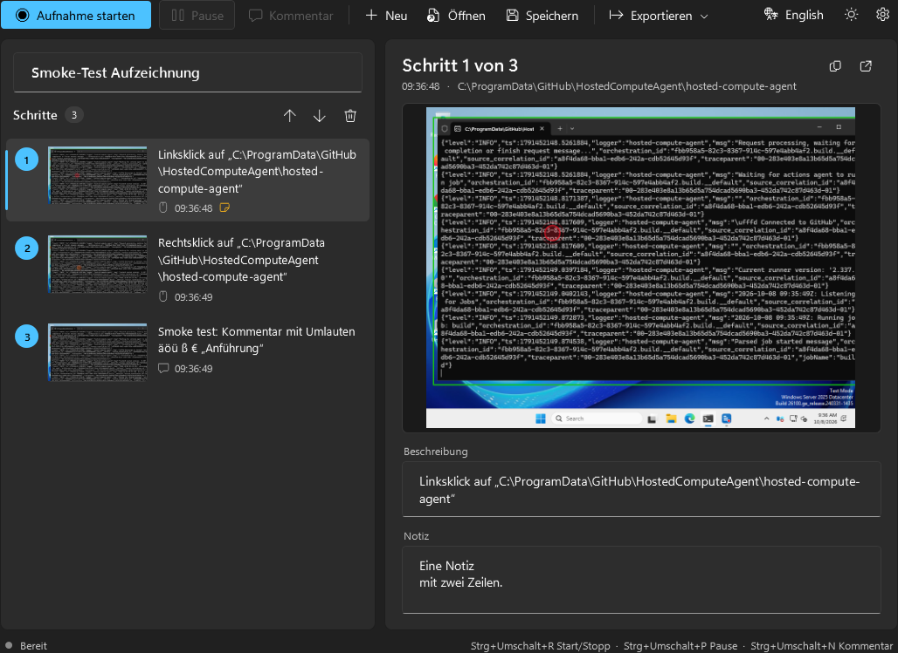
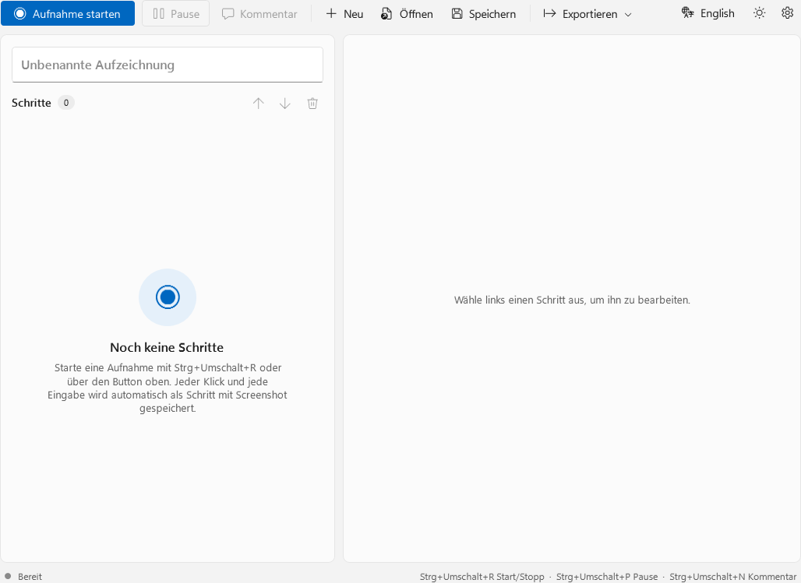
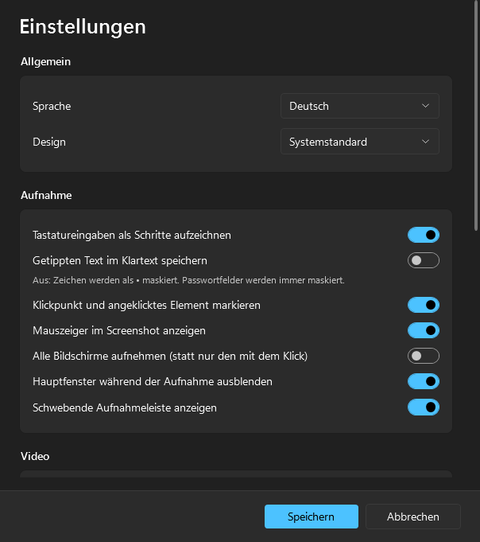
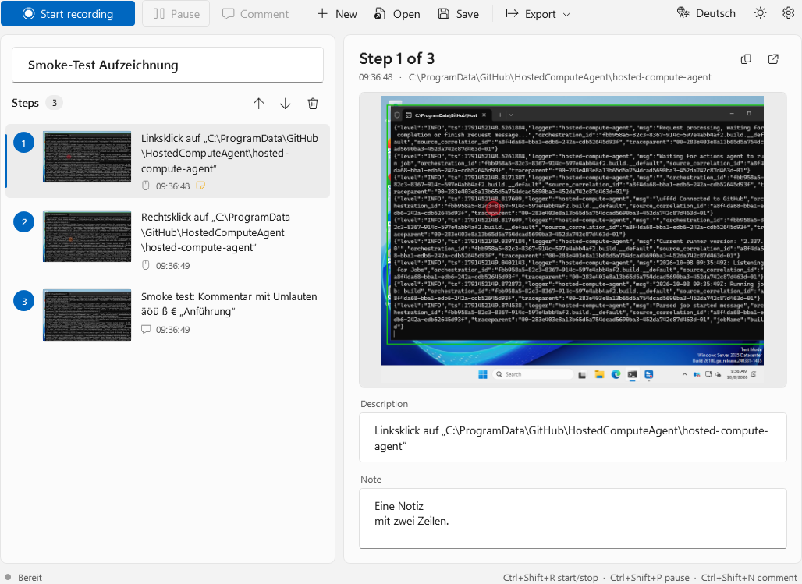
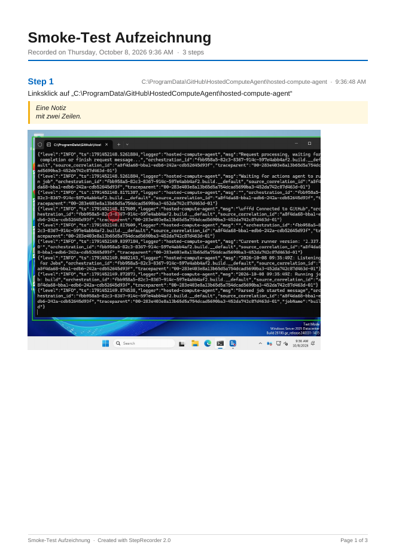

<div align="center">


# Schrittaufzeichnung 2.0

**Der moderne Nachfolger der Windows-Schrittaufzeichnung (`psr.exe`).**
Klicken, tippen, fertig – jeder Schritt wird automatisch mit Screenshot und Beschreibung festgehalten.
Export als PDF, interaktives HTML oder ZIP.

**Eine einzige `.exe` · keine Installation · keine Registry-Einträge · Deutsch & Englisch · Hell & Dunkel**

[⬇️ Download](#-download) · [Features](#-features) · [Bedienung](#-bedienung) · [FAQ](#-faq) · [English](#-english)



</div>

---

## ⬇️ Download

| Datei | Größe | Voraussetzung | Für wen? |
|---|---|---|---|
| **[StepRecorder2-portable-win-x64.exe](download/StepRecorder2-portable-win-x64.exe)** | 67 MB | **keine** | ✅ Empfohlen – läuft sofort auf jedem Windows 10/11 (64 Bit), auch vom USB-Stick |
| [StepRecorder2-net10-win-x64.exe](download/StepRecorder2-net10-win-x64.exe) | 0,5 MB | [.NET 10 Desktop Runtime](https://dotnet.microsoft.com/download/dotnet/10.0) | Wenn .NET 10 schon installiert ist |

Auf den Dateinamen klicken → rechts oben **„Download raw file“** (⬇️-Symbol).

> **Windows SmartScreen meldet sich beim ersten Start?**
> Die Datei ist nicht digital signiert (Zertifikate kosten Geld). Auf **„Weitere Informationen“ → „Trotzdem ausführen“** klicken. Der komplette Quellcode liegt in diesem Repository.

<details>
<summary>SHA-256-Prüfsummen</summary>

```
57435db689c59f8893be1d26e896f753c41fc1ea9f3a48b6400d2c352caf2d23  StepRecorder2-portable-win-x64.exe
d042de3efcf7e6e11896c60e84a87c68b51ff80930aac8761ad188b51e3fd09d  StepRecorder2-net10-win-x64.exe
```
Prüfen in PowerShell: `Get-FileHash .\StepRecorder2-portable-win-x64.exe`
</details>

---

## ✨ Features

| | |
|---|---|
| 🖱️ **Automatische Aufnahme** | Screenshot bei jedem Klick (links, rechts, Mitte – Doppelklicks werden erkannt) und bei Tastatureingaben. Getippter Text wird zu *einem* Schritt zusammengefasst, Tastenkombinationen (`Strg+C`, `F5` …) sind eigene Schritte. |
| 🧠 **Beschreibung von selbst** | z. B. *Linksklick auf „Speichern“ (Schaltfläche) in „Editor“*. Das angeklickte Element wird **grün umrahmt**, der Klickpunkt **rot markiert**. |
| ✏️ **Bearbeiten** | Schritte löschen (mit Rückgängig), per **Drag & Drop** umsortieren, Beschreibung ändern, **Notizen** hinzufügen, Titel vergeben. |
| 📄 **PDF-Bericht** | Druckfertig mit Titel, nummerierten Schritten, Notizen, Screenshots und Seitenzahlen. |
| 🌐 **Interaktives HTML** | *Eine* Datei zum Verschicken: Suche, Einzel-/Gesamtansicht, Pfeiltasten, Bild-Zoom, Hell/Dunkel, Druckansicht. Öffnet in jedem Browser. |
| 🗜️ **ZIP-Archiv** | Alle Screenshots als PNG + `Schritte.txt` (+ Video). |
| 🎬 **Video (optional)** | Parallel ein Bildschirmvideo (AVI, 2–30 FPS) – ohne Zusatzprogramme oder Codecs. |
| ⌨️ **Globale Hotkeys** | `Strg+Umschalt+R` Start/Stopp · `Strg+Umschalt+P` Pause · `Strg+Umschalt+N` Kommentar – frei änderbar. |
| 🕶️ **Läuft im Hintergrund** | Beim Aufnehmen verschwindet das Fenster; es bleiben eine kleine Leiste und ein Tray-Icon. **Die Leiste ist auf Screenshots unsichtbar.** |
| 🔒 **Datenschutz** | Getippter Text wird standardmäßig als `•••` gespeichert, **Passwortfelder immer**. Klartext nur, wenn du es einschaltest. |
| 💾 **Projekte** | Speichern/Öffnen als `.steps`-Datei, später weiterbearbeiten. |
| 🎨 **Windows-11-Design** | Fluent-Look, Hell / Dunkel / wie System. Sprache Deutsch ⇄ Englisch per Klick. |
| 🪶 **Leichtgewichtig** | Ohne Aufnahme praktisch 0 % CPU. Kein Dienst, kein Autostart, keine Installation. |

<table>
<tr>
<td></td>
<td></td>
</tr>
<tr>
<td align="center"><sub>Startbildschirm (hell)</sub></td>
<td align="center"><sub>Einstellungen (dunkel)</sub></td>
</tr>
<tr>
<td></td>
<td></td>
</tr>
<tr>
<td align="center"><sub>Englische Oberfläche</sub></td>
<td align="center"><sub>PDF-Export</sub></td>
</tr>
</table>

---

## 🚀 Bedienung

1. **`StepRecorder2-portable-win-x64.exe` starten.**
2. **Aufnahme starten** (Button oder `Strg+Umschalt+R`). Das Fenster verschwindet, oben erscheint die rote Aufnahmeleiste.
3. **Ganz normal arbeiten.** Jeder Klick und jede Eingabe wird ein Schritt.
   Etwas erklären? `Strg+Umschalt+N` → Kommentar eintippen → wird mit Screenshot eingefügt.
4. **Stopp** (Leiste oder `Strg+Umschalt+R`) → das Fenster kommt zurück.
5. **Nacharbeiten:** unnötige Schritte löschen, umsortieren, Notizen ergänzen.
6. **Exportieren → PDF / HTML / ZIP.** Fertig zum Verschicken.

### Tastenkürzel im Programm

| Taste | Aktion |
|---|---|
| `Entf` | Markierte Schritte löschen |
| `Strg+Z` | Löschen rückgängig |
| `Strg+↑` / `Strg+↓` | Schritt nach oben / unten |
| `Strg+N` / `Strg+O` / `Strg+S` | Neu / Öffnen / Speichern |
| Doppelklick aufs Bild | Im Standard-Bildbetrachter öffnen |

### Typische Einsätze
- 🛠️ **IT-Support:** „Schick mir mal, was du gemacht hast“ – Kollege nimmt auf, schickt das HTML.
- 📚 **Anleitungen:** Schritt-für-Schritt-Doku für Software, z. B. Kassensystem oder Mitgliederverwaltung.
- 🐞 **Fehlerberichte:** Exakter Klickpfad bis zum Fehler, mit Video.
- 🎓 **Einarbeitung:** Neue Mitarbeiter bekommen Abläufe als PDF.

---

## ❓ FAQ

**Ist das wirklich portabel?**
Ja. Die Einstellungen landen als `StepRecorder2.settings.json` **neben der .exe**. Nur wenn dieser Ordner schreibgeschützt ist (z. B. `C:\Program Files`), wird `%APPDATA%\StepRecorder2\` genommen. In die Registry wird **nichts geschrieben**, sie wird nur gelesen (für Hell/Dunkel). Arbeitsdaten einer Aufnahme liegen in `%TEMP%\StepRecorder2\` und werden beim Beenden gelöscht.

**Hinterlässt die .exe sonst Spuren?**
Die portable Version entpackt beim ersten Start einige Grafik-DLLs nach `%TEMP%\.net\`. Das macht .NET bei Einzel-.exe-Dateien grundsätzlich so. Mit der Umgebungsvariable `DOTNET_BUNDLE_EXTRACT_BASE_DIR` kannst du den Ort z. B. auf den USB-Stick legen.

**Wo ist meine Aufnahme nach dem Beenden?**
Nur dort, wo du sie gespeichert oder exportiert hast. Beim Schließen fragt das Programm nach, wenn etwas noch nicht gespeichert ist.

**Klicks in einem Programm werden nicht erkannt?**
Läuft das Programm als Administrator, muss auch Schrittaufzeichnung 2.0 als Administrator gestartet werden (Windows-Sicherheitsregel).

**Ein Bereich ist auf dem Screenshot schwarz.**
Manche Programme (z. B. Video-Player mit Kopierschutz) sperren Screenshots. Dagegen kann kein Tool etwas machen.

**Wie lang darf ein Video sein?**
Bis ca. 1,9 GB pro Aufnahme, bei 5 FPS in Full HD etwa 40 Minuten.

**Werden meine Passwörter mitgeschrieben?**
Nein. Passwortfelder werden immer als `•••` gespeichert. Normaler Text wird standardmäßig ebenfalls maskiert; Klartext gibt es nur, wenn du ihn in den Einstellungen einschaltest.

---

## 🛠️ Selbst bauen

Voraussetzung: [.NET 10 SDK](https://dotnet.microsoft.com/download/dotnet/10.0). Baut auf Windows, Linux und macOS.

```powershell
# Portable Einzel-.exe ohne Abhängigkeiten (~67 MB)
dotnet publish src/StepRecorder -c Release -r win-x64 --self-contained true -o publish/portable

# Kleine Einzel-.exe (~0,5 MB, braucht .NET 10 Desktop Runtime)
dotnet publish src/StepRecorder -c Release -r win-x64 --self-contained false -o publish/small
```

Oder `StepRecorder.sln` in Visual Studio öffnen.

Jeder Push baut die .exe per **GitHub Actions** auf Windows und startet einen End-to-End-Selbsttest (`StepRecorder2.exe --smoke-test <ordner>`): echte Aufnahme, alle Fenster gerendert, alle Exporte, Video, Speichern/Laden. Ein Tag `v*` erzeugt automatisch ein GitHub-Release.

<details>
<summary><b>Projektaufbau</b></summary>

```
download/                     Fertige .exe-Dateien
docs/screenshots/             Bilder für dieses README
src/StepRecorder/
├─ Core/
│  ├─ InputHookService.cs     Eigener Thread: Maus-/Tastatur-Hooks + globale Hotkeys
│  ├─ RecorderEngine.cs       Event → Screenshot → UI Automation → Markierung → PNG
│  ├─ ScreenCapture.cs        Bildschirmfoto, Mauszeiger, Klick-/Element-Markierung
│  ├─ UiaInspector.cs         „Was wurde angeklickt?“ – immer mit Timeout
│  ├─ VideoRecorder.cs        Echtzeit-Bildschirmvideo
│  └─ MjpegAviWriter.cs       Minimaler AVI-Container
├─ Export/                    Eigener PDF-Writer, PDF-, HTML-, ZIP-Export
├─ Services/                  Einstellungen, Sprachen, Design, Projekte, Tray-Icon
├─ Themes/                    Fluent-Styles hell/dunkel
└─ Views/                     Hauptfenster, Aufnahmeleiste, Einstellungen, Dialoge
```

**Technik:** C# · WPF · .NET 10 (LTS bis Nov. 2028) · Single-File-Publish · keine NuGet-Pakete.
**Warum WPF statt WinUI 3?** WinUI 3 lässt sich nicht sauber als einzelne .exe ohne Zusatz-Runtime ausliefern; WPF mit eigenen Fluent-Styles schon – und läuft auch auf Windows 10.
</details>

---

## 🇬🇧 English

**Steps Recorder 2.0** is a modern, portable successor of the Windows Steps Recorder (`psr.exe`).

- **Download:** [StepRecorder2-portable-win-x64.exe](download/StepRecorder2-portable-win-x64.exe) (67 MB, no requirements) or [StepRecorder2-net10-win-x64.exe](download/StepRecorder2-net10-win-x64.exe) (0.5 MB, needs [.NET 10 Desktop Runtime](https://dotnet.microsoft.com/download/dotnet/10.0)).
- Captures a screenshot on every click and keyboard input, with an automatic description via UI Automation (*Left click on "Save" (button) in "Notepad"*).
- Edit steps (delete, undo, drag & drop reorder, notes), save/open `.steps` projects.
- Export to **PDF**, **interactive single-file HTML** or **ZIP** (PNGs + text + video).
- Optional parallel screen video (MJPEG AVI, no codecs needed).
- Global hotkeys: `Ctrl+Shift+R` start/stop, `Ctrl+Shift+P` pause, `Ctrl+Shift+N` comment.
- Floating toolbar + tray icon; the toolbar is excluded from screenshots.
- Typed text is masked by default, password fields always.
- Windows 11 Fluent design, light/dark/system theme, UI switchable between German and English (top right button).
- Fully portable: settings next to the .exe, no registry writes, no installer.
